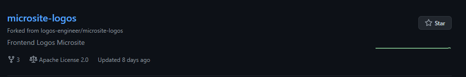

# Standard-collaboration

## Cara Berkontribusi

- Fork Repository ke dalam repo pribadi
   
  
  
- Ambil Issue yang sedang aktif, kemudian komentari "Dalam Pengerjaan - Username"
  
  
- Buat branch baru sesuai issue yang diambil pada forked repository
- Saat selesai, push hasil pekerjaan pada repo fork
- kemudian buat pull request pada repo main dengan deskripsi yang ditentukan

## Aturan Penamaan Branch

- feat- : Pembuatan fitur baru
- fix- : Perbaikan bug

#### contoh

- "feat-desktop-hero"
- "feat-desktop-feature"
- "feat-layout"
- "fix-styleguide-typo"
- "fix-footer-typo

## Aturan Label Issue

- Enhancement : Pembuatan atau permintaan fitur baru
- Bug : Pelaporan bug

## Aturan pull request

- Selalu kerjakan kode dan push pada repo fork
- Buat Pull Request untuk branch yang dikerjakan saat pekerjaan dirasa selesai
- Saat melakukan Pull Request cantumkan Keterangan dengan garis besar seperti berikut:

  ####

  Developer : @namakontributor
  Deskripsi : Perubahan yang dilakukan atau fix bug atau featur yang dikerjakan

  ## Image

  Sertakan Image jika diperlukan

  Pull Request ini ditujukan untuk issue #mentionIssue

  @reviewer Pull Request bisa direview

  ###

- dan yang terakhir minta review pada reviewer atau lead team
  ##### Contoh Pull Request
   
   

## Aturan Branch Development

## Aturan Branch Production / Main
